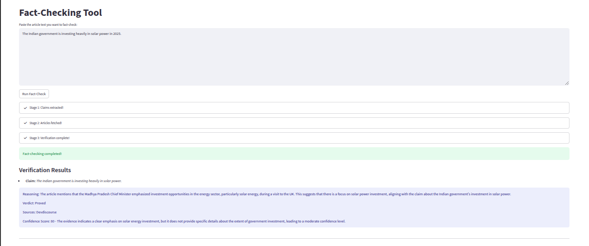

# 🕵️‍♂️ AI-Powered-Fact_Checking_Tool 📰

An innovative tool that leverages Large Language Models (LLMs) to automatically extract claims from articles, fetch relevant information from various news sources, and verify facts. This project aims to provide a robust and efficient way to assess the veracity of information.
---


## ✨ Features

- **🧠 Claim Extraction**: Automatically identifies and extracts distinct incidents and factual claims from input articles using LLMs. 
- **🌐 Intelligent Source Fetching**: Dynamically fetches evidence from multiple news sources (NewsData.io, GNews.io). 
- **✅❌❓ LLM-Powered Fact Verification**: Cross-references extracted claims with retrieved articles to generate a verdict (`Proved`, `Refuted`, `Unclear`), along with reasoning and confidence score. 
- **📊 Streamlined Workflow**: User-friendly **Streamlit** interface to run the entire fact-checking pipeline.   
- **📈 MLflow Tracking**: All model inputs/outputs, metrics, and artifacts are logged for experiment tracking and reproducibility.   
- **📄 JSON Outputs**: Each stage produces JSON outputs for transparency and auditability.   

---


---

## 🚀 Getting Started

### Prerequisites

Ensure you have the following installed:

- Python 3.12.9
- Git

---

### ⚙️ Installation

1. **Clone the Repository**

```bash
git clone https://github.com/abhishekanand-02/AI-Powered-Fact_Checking_Tool.git
cd AI-Powered-Fact_Checking_Tool
```
2. **Create a Virtual Environment**

```bash
python -m venv venv
```
3. **Activate the Virtual Environment**

- macOS/Linux:

```bash
source venv/bin/activate
```
- Windows:

```bash
.\venv\Scripts\activate
```
4. **Install Dependencies**

```bash
pip install -r requirements.txt
```
---

**🔑 Environment Variables**
This project uses API keys for external services. You must set them in a .env file.

- Create a .env file in the root directory.

- Add the following content:
```bash
OPENAI_API_KEY="your_openai_api_key_here"
NEWSDATA_API_KEY="your_newsdata_api_key_here"
GNEWS_API_KEY="your_gnews_api_key_here"
Note: Your .env is ignored by Git and won't be pushed to version control.
```

🏃 Running the Application
To launch the Streamlit interface:

```bash
streamlit run app.py
```
The application will open in your default browser. You can then paste an article and initiate the fact-checking process!

--- 

**💾 Output Files**
Upon completion, the following files will be created:

- **claims_from_articles.json** – Extracted claims and incidents

- **fact_verification_results.json** – Verdicts, reasoning, and confidence scores

- **filtered_articles.json** – Fetched articles used for evidence

🤝 Contributing
Feel free to open issues or submit pull requests for bugs, improvements, or feature requests.
Let’s build better tools for truth-telling, together. 💡

--- 
## 👨‍💻 Author

**Abhishek Anand**  
Python Developer | AI Enthusiast  
🔗 [GitHub](https://github.com/abhishekanand-02) | 📧 bgsabhishekanand02@gmail.com  

---


